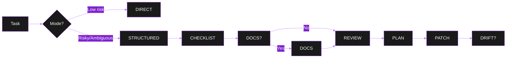

# ⚡ QUICKSTART

> 🎯 **5-minute onboarding** — Get from zero to first structured review session.

---

## 📋 Prerequisites

| Requirement | Version | Check |
|---|---|---|
| Node.js | 20+ | `node --version` |
| Git | 2.30+ | `git --version` |
| PowerShell | 7.6+ (pwsh) | `pwsh --version` |

---

## 🚀 Deploy to a Target Project

```powershell
# 1. Copy the prompt-system folder
Copy-Item -Recurse prompt-system <target-project>\prompt-system

# 2. Paste AGENTS.md content as AGENTS.md at target repo root
# (Copy contents of this repo's AGENTS.md to target/AGENTS.md)
```

---

## 🔐 Configure Secrets (One-time)

```bash
# At target project root
echo "EXA_API_KEY=exa-xxx" > .env
echo ".env" >> .gitignore
source .env  # or .\.env in PowerShell
```

| Service | Key Source | Required |
|---|---|---|
| Exa | exa.ai → Dashboard | Tier 2 (optional) |
| Context7 | None | Tier 1 (always) |
| Playwright | None (Node 20+) | Tier 1 (always) |
| Trello | OAuth (browser) | OAuth (optional) |

---

## 🎮 First Session

```bash
cd <target-project>
# Open opencode
# Describe a task:
```

**Example 1 — Code Review (Structured):**
```text
Review src/auth/token.ts for security issues.
```
→ Agent: CHECKLIST → DOCS (Context7) → REVIEW (decision) → PLAN (approval) → PATCH

**Example 2 — Feature Implementation (Structured):**
```text
Add rate limiting to the Express API using express-rate-limit.
```
→ Agent: fetches docs → proposes plan → patches after approval

**Example 3 — Quick Fix (Direct):**
```text
Fix typo in README.md line 42.
```
→ Agent: `[MODE: DIRECT]` → edits → verifies → commits

---

## 🧭 Navigation

| Need | Go To |
|---|---|
| Deploy details | `USER_GUIDE/GETTING_STARTED.md` |
| Which persona? | `USER_GUIDE/PERSONAS.md` |
| Phase flow? | `USER_GUIDE/PHASES.md` |
| Execution modes? | `USER_GUIDE/EXECUTION_MODES.md` |
| Troubleshooting? | `USER_GUIDE/TROUBLESHOOTING.md` |
| Architecture? | `REFERENCE/SYSTEM_OVERVIEW.md` |
| Rubrics? | `REFERENCE/RUBRICS.md` |
| Rules? | `REFERENCE/RULES.md` |
| Style defaults? | `REFERENCE/IMPLEMENTATION_STYLE.md` |
| Protocols? | `REFERENCE/PROTOCOLS.md` |
| Patch protocol? | `REFERENCE/PATCH_PROTOCOL.md` |
| Plan-actual gate? | `REFERENCE/PLAN_ACTUAL_GATE.md` |
| Session state? | `REFERENCE/SESSION_STATE.md` |
| OpenCode setup? | `USER_GUIDE/OPENCODE.md` |
| Project management? | `PROJECT_MANAGEMENT/ROADMAPS.md` |

---

## ⌨️ Essential Commands (OpenCode)

| Command | Purpose |
|---|---|
| `/baba sensei` | Activate BabaSensei for review |
| `/baba dev` | Activate BabaDev for implementation |
| `/phase REVIEW` | Declare REVIEW phase |
| `/approve-plan` | Persist plan approval + rewrite contract |
| `/verify` | Inspect diff, run checks, commit/push gate |
| `/auto` / `/direct` / `/structured` | Switch execution mode |
| `/review-consolidated` | Aggregate review mode |
| `/review-interactive` | Batch-by-batch review mode |

---

## 🎨 Visual Theme

This documentation uses **dark + purple** Mermaid diagrams and emoji/color hints for GitHub/VS Code dark mode.



---

## ✅ Verify It Works

Ask your agent: **"List the available MCP tools."**

Expected: Context7, Playwright at minimum. Exa if `EXA_API_KEY` set. Trello after OAuth.

---

> 💡 **Pro tip**: The system auto-detects `AUTO` vs `DIRECT` vs `STRUCTURED`. Override with `/direct` or `/structured` if needed.
