# 🏗️ SYSTEM OVERVIEW

> 💡 **Architecture, load order, file map** — The Baba prompt system structure.

---

## 📐 Architecture Layers

```mermaid
%%{init: {'theme': 'base', 'themeVariables': {
  'primaryColor': '#a855f7', 'primaryTextColor': '#fafafa',
  'primaryBorderColor': '#c084fc', 'lineColor': '#c084fc',
  'secondaryColor': '#7e22ce', 'tertiaryColor': '#581c87',
  'background': '#0f0f0f', 'mainBkg': '#1a1a1a',
  'secondBkg': '#262626', 'tertiaryBkg': '#3d3d3d',
  'textColor': '#fafafa', 'nodeBorder': '#a855f7',
  'clusterBkg': '#2d1b4e', 'clusterBorder': '#a855f7'
}}}%%
flowchart TD
    subgraph PORTABLE["Portable Unit"]
        AGENTS["AGENTS.md\n📝 Entry Point"]
        PS["prompt-system/\n⚙️ Core System"]
    end
    
    subgraph ADAPTERS["Adapter Layers"]
        OPENCODE[".opencode/ + opencode.jsonc\n🟢 OpenCode"]
        CLAUDE["CLAUDE.md + .mcp.json + .claude/\n🔵 Claude Code"]
        CODEX[".codex/config.toml\n🟡 Codex CLI"]
    end
    
    AGENTS --> PS
    PS --> OPENCODE
    PS --> CLAUDE
    PS --> CODEX
    
    style AGENTS fill:#2d1b4e,stroke:#a855f7
    style PS fill:#1a1a1a,stroke:#a855f7
    style OPENCODE fill:#2d1b4e,stroke:#4ade80
    style CLAUDE fill:#2d1b4e,stroke:#3b82f6
    style CODEX fill:#2d1b4e,stroke:#fbbf24
```



| Layer | File(s) | Purpose |
|---|---|---|
| 🟢 Entry | `AGENTS.md` | Portable entry point, MCP tiers, system pointer |
| 🔵 Orchestrator | `prompt-system/00-system.md` | Phase model, routing, hard guards, load order |
| 🟣 Personas | `prompt-system/01-personas.md` | 6 personas + handoff contract + session flow |
| 🟠 Decisions | `prompt-system/02-decision-prompts.md` | Decision format, rendering rule, auto-triggers |
| 🟡 Output | `prompt-system/03-output-and-state.md` | Phase templates, dual-section output, session state schema |
| 🔴 Rubrics | `prompt-system/04-rubrics.md` | H1-H40, S1-S20, L1-L10 review rubrics |
| 🟢 Style | `prompt-system/05-impl-style.md` | Implementation style, stack variants, conventions |
| ⚫ Patch | `prompt-system/06-misc.md` | PATCH protocol, commit/push gate, leftover handling |
| 🟤 Protocols | `prompt-system/07-protocols.md` | Cross-cutting protocols (artifacts, pre-commit, drift, etc.) |
| ⚪ Gate | `prompt-system/08-plan-actual-gate.md` | Plan-vs-actual verification protocol |
| 🔵 Rules | `prompt-system/rules.md` | H13-H40 mechanical detection/enforcement |

---

## 📂 File Map

```
.
├── AGENTS.md              # Entry point
├── README.md              # Navigation hub
├── CHANGELOG.md           # Version history
├── STYLE_POLICY.md        # Project style policy
├── BOOTSTRAP.md           # Bootstrap instructions
├── CLAUDE.md              # Claude Code memory
├── LOGICAL_RUBRICS.md     # Logical rubrics reference
├── prompt-system/
│   ├── 00-system.md       # Orchestrator
│   ├── 01-personas.md     # Personas
│   ├── 02-decision-prompts.md  # Decisions
│   ├── 03-output-and-state.md  # Templates
│   ├── 04-rubrics.md      # Rubrics
│   ├── 05-impl-style.md   # Style
│   ├── 06-misc.md         # PATCH protocol
│   ├── 07-protocols.md    # Protocols
│   ├── 08-plan-actual-gate.md  # Plan-actual gate
│   └── rules.md           # H13-H40 rules
├── docs/
│   ├── QUICKSTART.md
│   ├── GLOSSARY.md
│   ├── USER_GUIDE/
│   ├── REFERENCE/
│   ├── PLATFORM_ADAPTERS/
│   └── PROJECT_MANAGEMENT/
├── opencode.jsonc
├── .opencode/
├── .claude/
├── .codex/
├── project-management/
└── sync.ps1
```

---

## 📖 Documentation Structure

| Folder | Files | Purpose |
|---|---|---|
| `docs/QUICKSTART.md` | 1 | 5-minute onboarding |
| `docs/GLOSSARY.md` | 1 | Central terminology reference |
| `docs/USER_GUIDE/` | 5 | Getting started, personas, phases, modes, troubleshooting |
| `docs/REFERENCE/` | 8 | Canonical system references (mirrors `prompt-system/`) |
| `docs/PLATFORM_ADAPTERS/` | 3 | OpenCode, Claude Code, Codex CLI setup |
| `docs/PROJECT_MANAGEMENT/` | 3 | Roadmaps, sprints, Trello integration |

---

## 🔗 Key Cross-References

| Need | Document |
|---|---|
| Phase flow | `USER_GUIDE/PHASES.md` |
| Execution modes | `USER_GUIDE/EXECUTION_MODES.md` |
| Rubrics | `REFERENCE/RUBRICS.md` |
| Rules (H13-H40) | `REFERENCE/RULES.md` |
| Style defaults | `REFERENCE/IMPLEMENTATION_STYLE.md` |
| Protocols | `REFERENCE/PROTOCOLS.md` |
| PATCH protocol | `REFERENCE/PATCH_PROTOCOL.md` |
| Plan-actual gate | `REFERENCE/PLAN_ACTUAL_GATE.md` |
| Session state | `REFERENCE/SESSION_STATE.md` |
| OpenCode setup | `PLATFORM_ADAPTERS/OPENCODE.md` |
| Claude Code setup | `PLATFORM_ADAPTERS/CLAUDE_CODE.md` |
| Codex CLI setup | `PLATFORM_ADAPTERS/CODEX_CLI.md` |

---

> 📝 **Source**: This file is new. For canonical definitions, see the corresponding `prompt-system/` files.