# 🔄 PHASES

> 💡 **Phase flow, templates, decision format** — The structured workflow engine.

---

## 🌊 Phase Flow Diagram

```mermaid
%%{init: {'theme': 'base', 'themeVariables': {
  'primaryColor': '#a855f7', 'primaryTextColor': '#fafafa',
  'primaryBorderColor': '#c084fc', 'lineColor': '#c084fc',
  'secondaryColor': '#7e22ce', 'tertiaryColor': '#581c87',
  'background': '#0f0f0f', 'mainBkg': '#1a1a1a',
  'secondBkg': '#262626', 'tertiaryBkg': '#3d3d3d',
  'textColor': '#fafafa', 'nodeBorder': '#a855f7',
  'clusterBkg': '#2d1b4e', 'clusterBorder': '#a855f7'
}}}%%
flowchart TD
    START([START]) --> STARTUP[STARTUP\n🔒 Mandatory]
    STARTUP -->|Concrete target| CHECKLIST
    STARTUP -->|Goal, no target| INTAKE
    STARTUP -->|Exploratory| DISCUSS
    STARTUP -.->|STARTUP incomplete| BLOCKED
    
    INTAKE --> BACKLOG
    BACKLOG --> SPRINT
    SPRINT --> TASK_PLAN
    TASK_PLAN -->|Spec needed| SPEC
    TASK_PLAN -->|No spec| CHECKLIST
    SPEC --> CHECKLIST
    
    CHECKLIST -->|Docs needed| DOCS
    CHECKLIST -->|No docs| REVIEW
    DOCS --> REVIEW
    
    REVIEW -->|Tester loaded| TEST_STRATEGY
    REVIEW -->|Standard| PLAN
    TEST_STRATEGY --> HANDOFF_T
    HANDOFF_T --> PLAN
    
    PLAN -->|UI/UX| DESIGN_PLAN
    PLAN -->|Standard| HANDOFF_P
    DESIGN_PLAN --> HANDOFF_D
    HANDOFF_D --> PATCH
    HANDOFF_P --> PATCH
    
    PATCH -->|Spec-backed| DRIFT
    PATCH -->|On demand| DRIFT
    PATCH -->|Done| CLOSE([CLOSE])
    
    DRIFT -->|Writes needed| PLAN
    DRIFT -->|Clean| PRIOR
    
    DISCUSSION[DISCUSS] -.->|Promote| FORMAL
    DISCUSSION -.->|Resume| PRIOR
    
    style STARTUP fill:#2d1b4e,stroke:#a855f7
    style BLOCKED fill:#581c87,stroke:#f87171
    style DISCUSS fill:#1a1a1a,stroke:#c084fc
    style CLOSE fill:#1a1a1a,stroke:#4ade80
```



---

## 📋 Phase Summary

| Phase | Purpose | Template | Key Output |
|---|---|---|---|
| `STARTUP` | Load system, emit fingerprint | — | Fingerprint + loaded files |
| `INTAKE` | Goal, stack, scope, criteria, milestones | `INTAKE` | Approved intake → BACKLOG |
| `BACKLOG` | ICE-prioritized items by milestone | `BACKLOG` | Backlog → SPRINT |
| `SPRINT` | Selected items, board, criteria | `SPRINT` | Sprint plan → TASK_PLAN |
| `TASK_PLAN` | Single task card with DoD | `TASK_PLAN` | Task card → CHECKLIST/SPEC |
| `SPEC` | Author spec artifact in `SPECS/` | `SPEC` | Spec artifact → CHECKLIST |
| `CHECKLIST` | File inventory, criteria, docs log | `CHECKLIST` | Inventory + verdict → DOCS/REVIEW |
| `DOCS` | Version/evidence for judgments | `DOCS` | Verified evidence → REVIEW |
| `REVIEW` | Score findings, mitigations, decision | `REVIEW` | Confirmed items → PLAN |
| `TEST_STRATEGY` | Binding/strong/weak hints | `TEST_STRATEGY` | Test strategy → HANDOFF |
| `PLAN` | Fix plan, conventions, rewrite contract | `PLAN` | Approved plan → PATCH |
| `DESIGN_PLAN` | UI/UX decisions, constraints | `DESIGN_PLAN` | Design plan → HANDOFF |
| `HANDOFF` | Persona-to-persona contract | `HANDOFF` | Validated payload → next phase |
| `PATCH` | Implementation + verification | `PATCH` | Diff + commit/push → DRIFT/close |
| `DRIFT` | Spec vs code (read-only) | `DRIFT` | Findings → PLAN/prior |
| `DISCUSS` | Exploratory conversation | — | Promoted items → formal |
| `FAILURE` | Protocol breach after retry | `FAILURE` | Await explicit retry |

---

## ⏭️ Deterministic Skips (No Confirmation)

| Skip | Condition | Recorded |
|---|---|---|
| `DOCS` | No version-sensitive judgment in scope | Skip reason in phase artifact |
| Upstream (INTAKE→TASK_PLAN) | Concrete target at session start | Skip reason in session state |
| `CHECKLIST`/`REVIEW` | Greenfield (no existing source) | `skipped (greenfield)` in checklist |
| `SPRINT` | Explicit user request | Skip reason recorded |

**Rule:** Model-decided skips auto-advance; never pause for confirmation.

---

## 🚫 Blocked Conditions

`BLOCKED` emitted when prerequisites missing. Always includes:
- `Blocked action`
- `Reason` (specific, not generic)
- `Needed now` (actionable items)
- `Next required user action` (smallest unit)
- `Status: Waiting`

**Before emitting BLOCKED for missing file/path:** Agent searches filesystem (`rg`, glob, read tools).

---

## 📝 Decision Format (Mandatory)

When user decision required, current phase header +:

```markdown
# Decision Needed
Question: [short question]
Recommended: **A** -- [one-sentence reason]

- **A.** [recommended option]
  - Pros: [short]
  - Cons: [short]
- B. [option]
  - Pros: [short]
  - Cons: [short]
- C. [option, if needed]
  - Pros: [short]
  - Cons: [short]

Reply with: A, B, or C
```

**Rules:**
- Recommended = **A** (bold, first)
- Max 2 decisions per response (hard cap)
- No open-ended questions (`## Open question for you` forbidden)
- No standalone CONFIRM phase (confirmation lives in REVIEW)

---

## 📄 Phase Templates (Reference)

### CHECKLIST
- Target scope, focus, scope type
- File inventory with discovery metadata
- System Discovery (auto-populated)
- Pre-review docs log
- Hard tier (H1-H40), Soft tier (S1-S20), Logical (L1-L10)
- Verification commands
- Batch log, Verdict

### REVIEW
- Multi-file progress, Reading Verification
- Findings with Mitigations (A/B/C + pros/cons)
- Logical Findings (blocking/advisory)
- Validation loop (confidence ≤70%)
- Decision Needed (confirmation)
- Next batch or aggregate

### PLAN
- Target, scope, pending review items
- System Constraints (from Discovery)
- Will change / Will preserve (with verify commands)
- Conventions (per-file idiom evidence)
- Risks, Logical constraints
- Awaiting: Plan approval

### PATCH
- Rewrite Contract (target, preserve, eliminate, forbidden, must-use, must-route, etc.)
- Patch code/diff
- Self-Review checklist
- Compliance Audit (PASS/FAIL per item)
- Constraint Verification (rg checks)
- Verification (diff, lint, checks, regression, Playwright)
- Plan-Actual (per-item evidence)
- Commit/Push Gate (decision A/B/C)

---

## 🔗 Key Cross-References

| Topic | Document |
|---|---|
| Phase templates (full) | `prompt-system/03-output-and-state.md` |
| Decision format details | `prompt-system/02-decision-prompts.md` |
| Hard guards | `prompt-system/00-system.md` |
| Rubrics | `REFERENCE/RUBRICS.md` |
| Rules (H13-H40) | `REFERENCE/RULES.md` |
| Patch protocol | `REFERENCE/PATCH_PROTOCOL.md` |
| Plan-actual gate | `REFERENCE/PLAN_ACTUAL_GATE.md` |
| Session state schema | `REFERENCE/SESSION_STATE.md` |
